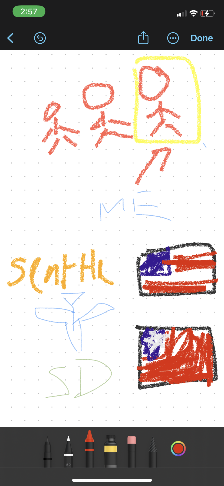

# Trevor's CSP Blog 
This is where I'll start my blogging journey through CSP!

# Useful Links
<a href="https://www.w3schools.com/">W3Schools</a>

<a href="https://stackoverflow.com/">Stack Overflow</a>

<a href="https://chat.openai.com/">ChatGPT</a>

## Day 2 of Blogging, 8/22
My partner helped me post my freeform photo onto the website and adjust its size. I also linked some websites I always use for this class. I accidently made a lot of changes in index.html without knowing that it automatic overwrites. Luckily, I had enough time to redo my changes in index.md.

## Day 1 of Blogging, 8/21
I practiced commiting and pushing to github while making some minor edits to my website such as renaming it.

## Day 0.5 of Blogging 8/19-20
I ran into an error: "Wsl/Service/CreateInstance/MountVhd/ERROR_FILE_NOT_FOUND". I asked ChatGPT and it prompted me to run "wsl --unregister Ubuntu" and "wsl --install -d Ubuntu". This solved the issues.

## Day 0 of Blogging, 8/18
I ran into some issues with WSL. I accidentally exited after being prompted to enter a password, so I was stuck as "root". I tried to solve the issue by uninstalling and then reinstalling WSL.